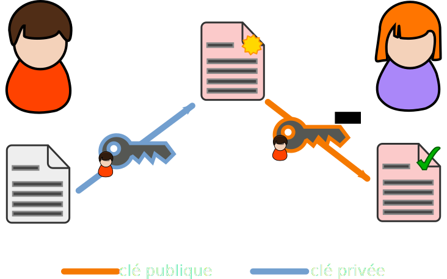

#GPG en 30 minutes
Challenge accepted

<a href="https://twitter.com/Mayeu">@Mayeu</a>

<footer>
   
</footer>

------------------

```example-mail
To: bob@example.com
From: alice@example.com
Subject: Un e-mail

Ceci est un e-mail
```
<details>
Ceci est un e-mail. Simple fichier texte qui vas passer de machine en machine.
Équivalent à une carte postale.
</details>

------------------


<details>
Va passer par de multiple serveur avant d'arriver au destinataire.

N'importe qui peut écouter & modifier le mail, n'importe qui pourrait envoyer
un message depuis une autre source
</details>

------------------

```example-mail
To: putin@kremlin.ru
From: obama@whitehouse.gov
Subject: Ukraine

Yes we can!
```
<details>
Par exemple, donnez ça à un serveur de mail et il va gentillement l'accepter.

Donc ce qu'il serait bien, c'est de pouvoir protéger nos e-mails, et s'assurer
que l'émetteur est le bon :)
</details>

------------------

#Chiffrement symétrique


<details>
Exemple, on peut partager un secret et on chiffre avec.

Problème: échange la clé de manière sécurisé (facile localement, impossible à distance).

Rien que pour ce problème, des mathématiciens ont inventé le chiffrement asymétrique.
</details>

------------------

#Chiffrement asymétrique


<details>
Chaque personne possède un couple de clé. Propriété mathématique rigolote, ce
qui est chiffré avec une clé de la paire peut être déchiffré avec l'autre. On
défini une clé publique et une privée à partir de ces deux clés.

La clé privée doit être gardée secrète. La clé publique peut être donnée à
n'importe qui.
</details>

------------------

#Chiffrement


<details>
Envoyer un message à Alice : on chiffre avec sa clé publique, elle déchiffre
avec sa clé privée. Comme elle est la seule à posséder la clé privée, on est
sûr qu'elle est la seule à pouvoir lire le message.
</details>

------------------

#Signature


<details>
Prouver que Bob est bien l'émetteur revient à chiffrer avec un secret qu'il est
le seul à posséder, arriver à déchiffrer le message prouve donc qu'il en est
l'émetteur.
</details>

------------------

#En somme

Alice utilise **sa clé privée** pour **déchiffrer** les messages reçus et
**signer** les messages envoyés.

Alice utilise **la clé publique de Bob** pour **chiffrer** les messages envoyés
et **vérifier la signature** des messages reçus.

------------------

#GPG


* Phill Zimmerman en 1991
* Gestion d'identité
* Chiffrement d'email, de fichier
* Toile de confiance

<details>
GPG est un outil qui permet cela. Phill créer en 91 PGP, qui deviendra le
standard OpenPGP, et dont l'implémentation libre s'appelle Gnu Privacy Guard.

Permet de créer/gérer des identités, accéder aux annuaires publiques, chiffrer
et signer des fichiers et des emails. Et introduit la notion de toile de
confiance (qu'on ne détaillera pas ici).
</details>

------------------

#GPG n'est pas magique

```mail-clair
To: me@example.com
From: alice@example.com
Subject: Un e-mail

Ceci est un e-mail
```

```mail-chiffre
To: me@example.com
From: alice@example.com
Subject: Un e-mail

-----BEGIN PGP MESSAGE-----
Version: GnuPG v2

hQIMA6aVRtdNKfspAQ//fs/ibVA
b3BhtlpnYeayxjcYjVM5F6E3gx+
/........./w3g+tnCxcaCmDYWw
lUE+MpXtLzfkWqq3Dz3enQyCMSw
Pg4KJxNlhXnzM6+xtd7o6ue9ajL
S7pby/A4OWmZ7DX3g===XmGf
-----END PGP MESSAGE-----
```

<details>
En-tête et sujet non chiffré ! Aussi attention : signature = 100% sur que c'est
le possesseur de la clé qui à envoyé le mail. Attention à ce que vous écrivez,
et à qui vous l'envoyez ;)
</details>

------------------
# The rest is TODO.
[[ installation thunderbird + gpg + enigmail, mettre les liens ]]

* Générer une identité
* certificat de revocation
* Passer la clé publique
* envoyer un e-mail

GG

Source /lien
* google transparency report http://www.google.com/transparencyreport/saferemail
* smtp image: https://en.wikipedia.org/wiki/Simple_Mail_Transfer_Protocol#mediaviewer/File:SMTP-transfer-model.svg
