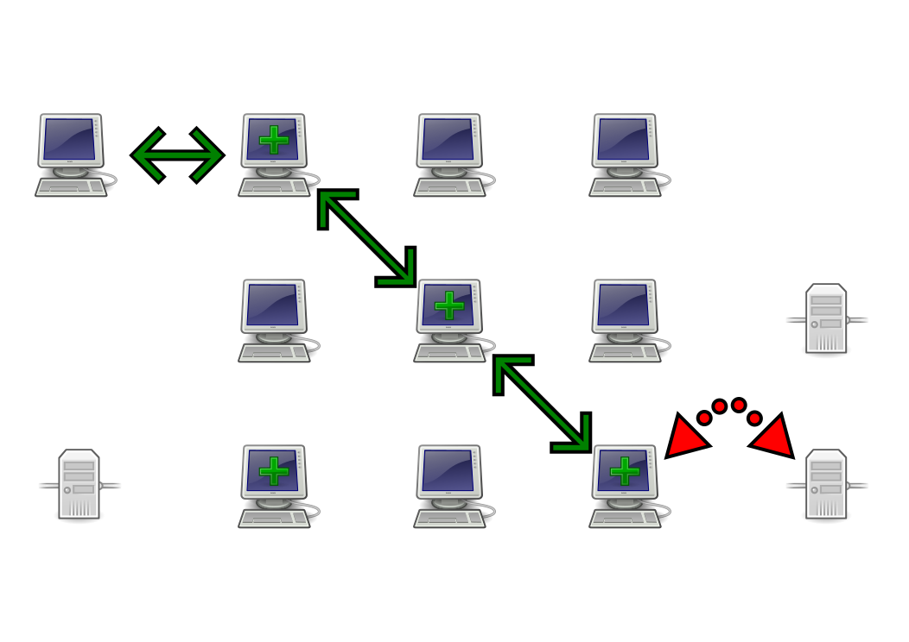
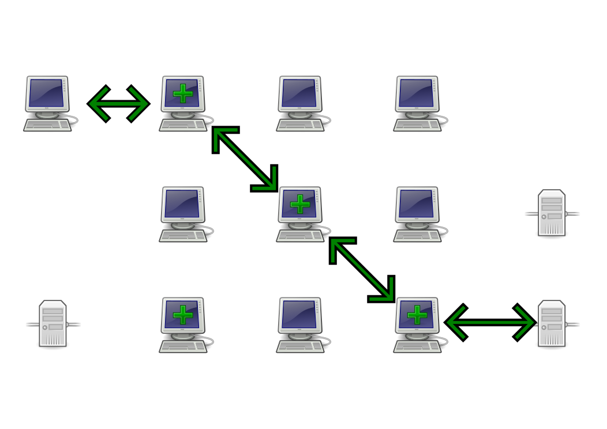

##{**Pseudo**|**Ano**}**nymisation** du web avec **Tor**

<a href="https://twitter.com/CryptoCH">@CryptoCH</a>

<footer>
   
</footer>

# **IP**, **HTTP**, **HTTPS**

------------------

## **I**nternet **P**rotocol

- paquets qui **transitent** sur le réseau
- **adresse IP** (ex: 192.168.0.1)
- adresses de **destination** et **émetteur**
- contenu

------------------

## HTTP

- **rien** n'est chiffré
- trop souvent par défaut un peu partout **:'(**

------------------

## HTTP**S**

- **IP** source et destination visible
- contenu chiffré
- entre **soi** et le **serveur** contacté
- Plugin Firefox : HTTPS Everywhere

Permet de chiffrer le contenu. Évidemment si on discute avec Google, Google
**sait** ce qu'on envoie.

# Tor

------------------

## Origine

- projet du U.S Naval Laboratory (1996)
- **T**he **O**nion **R**outing project
- 2004 : "Tor: The Second-Generation Onion Router"
- Fondation à but non lucratif

Fondation dont les développeurs et salariés se font arrêter aux frontières de
pays "libre" pour faire pression.

------------------

## Usage

- Passer au travers des firewalls
- Protection contre l'espionnage
- Contourner la censure

------------------

## Fonctionnement

- enrobe les autres protocoles
- Tor ne **protège pas** le contenu
- masque l'adresse source et destination
- fait **rebondir** les paquets au sein du réseau

contrairement à https (pour le web), Tor ne chiffre pas le contenu, mais masque
les adresses source et destination.  effet flipper, on ne sait plus d'où vient
l'info.

------------------

------------------

## Hidden Services

- service caché au sein du réseau
- l'**émetteur** ne sait pas où est le **destinataire**
- http://**3g2upl4pq6kufc4m.onion**

Les services cachés permettent de camoufler un service au sein du résau Tor.
L'avantage c'est que même la personne qui accède au service ne **sait pas** où
est hébergé le service. Exemple d'adresse, le site DuckDuckGo.

------------------

------------------

## Le réseau

* entièrement **volontaire**
* **~5000** noeuds
* **~1000** noeuds de **sorties**

------------------

# Go ? https://**torproject**.org

- bug
